# AutoHotkeyScripts

This is a small AutoHotKey Script to get git author name, label github questions, and post templates for Git IR, MSDN Follow up, and git follow up, and some other things.

Autohotkey is a way to press a bunch of keys, when pressing one key. 
This script converts the number keypad into a set of macros. 

I've begun using this and figured to share it out to the team to see if anyone's interested in using it. 

# Installation
*From the guide*

Before learning to use AutoHotkey (AHK), you will need to download it. 

After downloading it, you may possibly need to install it. But that depends on the version you want. For this guide we will use the Installer since it is easiest to set up.

Click Download: https://autohotkey.com/download/ahk-install.exe

During installation of AutoHotkey, you will be asked to choose from UNICODE or ANSI. In short, you would probably want to choose UNICODE. It has support for non-English letters and numbers (characters). 

Keep going until you see an Install button.

Once you're done, you can double click a AHK Script to run the script. 

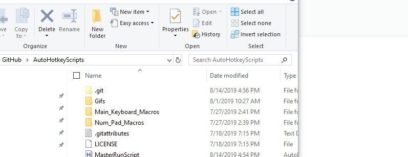

If there are any questions about installing AutoHotKey, and running the scripts please let me know. 

*Official Docs*

To install ahk - https://www.autohotkey.com/download/

A short tutorial on how to use authotkey : https://www.autohotkey.com/docs/Tutorial.htm

# Stopping Scripts

You can stop a script by going to your task bar and right clicking and stopping it. 

# Setting Up Scripts to Run on Startup

All executables you want to run on startup can be found in the folder path : 

`C:\Users\<replace-your-username>\AppData\Roaming\Microsoft\Windows\Start Menu\Programs\Startup`

So if you would like for the an autohotkey to run on startup, create a shortcut of an autohotkey and put it in the startup folder. 
See the gif below.

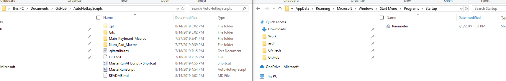

# Functionality

**1. Get Github Author Name**
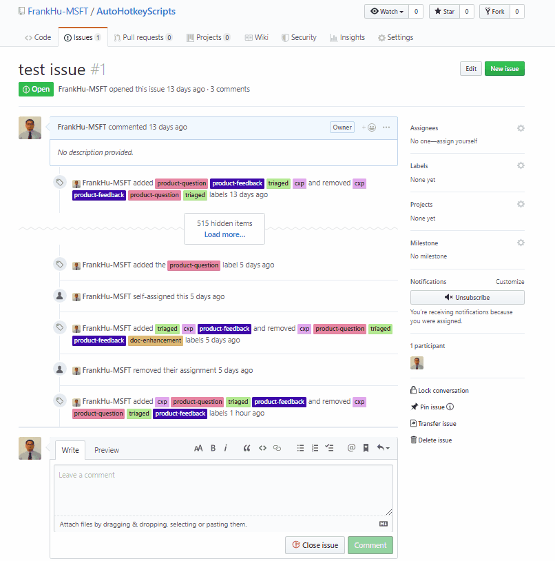

**2. label github question as product-question**
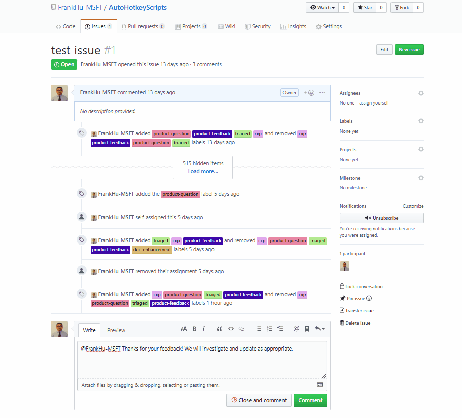

**3. paste github template with author name. (You have to get the author name first by pressing 1)**
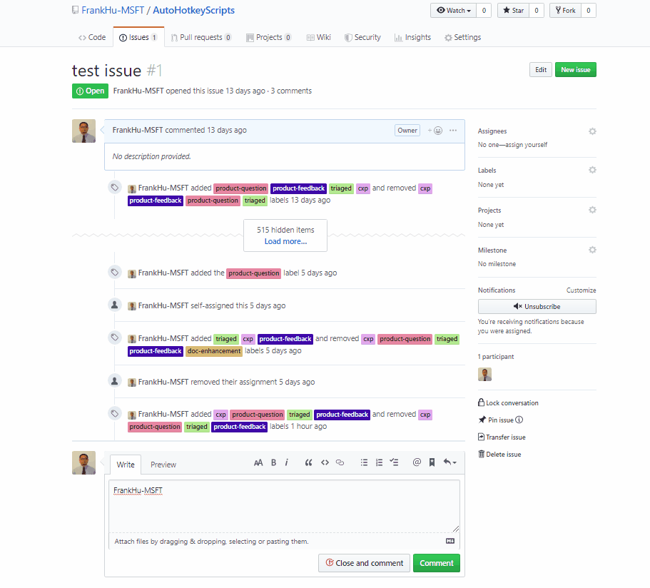

**4. opens notepad++**
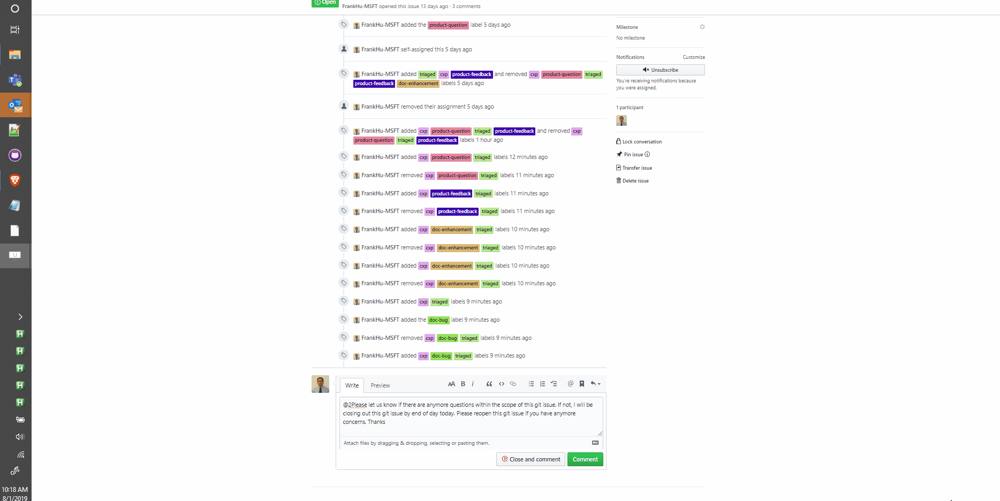

**5. label github question as product-feedback**
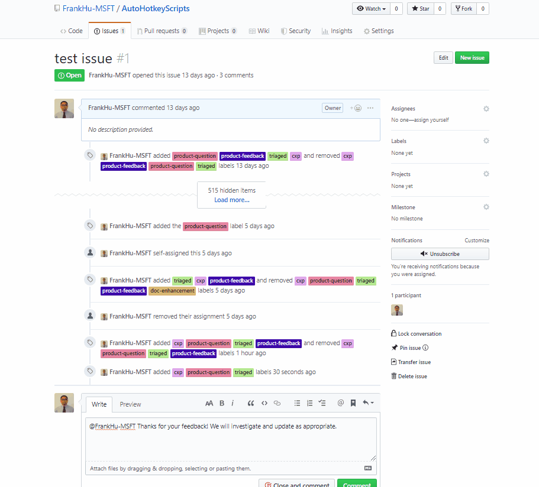

**6. decodes URL and wraps on parameters (for getting jwt tokens)**
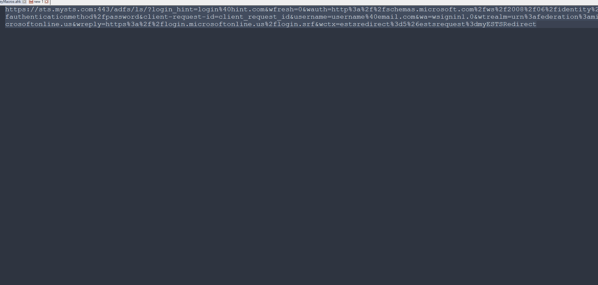

**7. Github follow up response template. Has three variations, hold 0 or 7 for different variation. (You have to get the author name first by pressing 1)** 
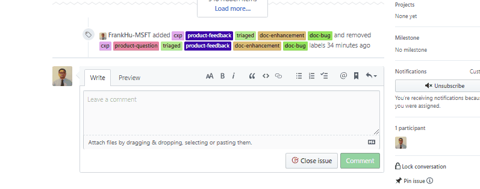
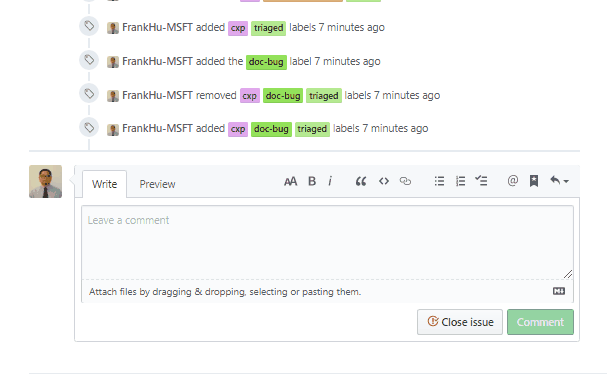

**8. doc-enhancement label for github issues**
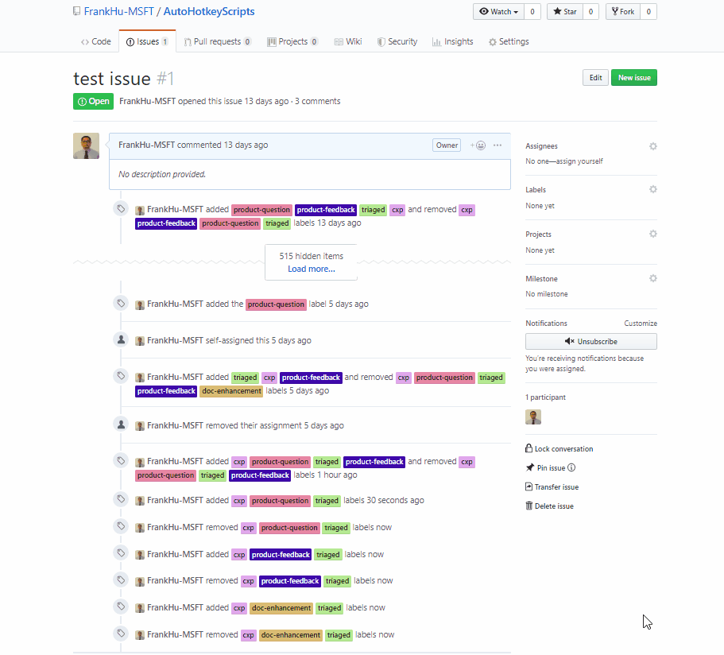

**9. msdn followup template. Has three variations, hold 0 or 7 for different variation.**
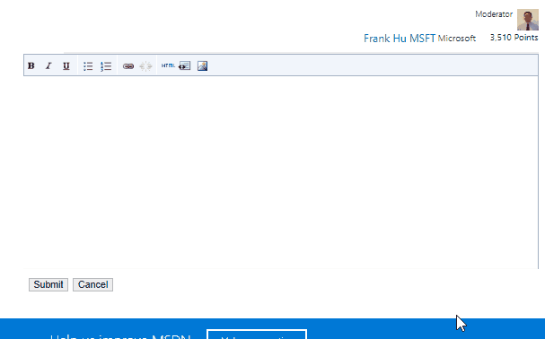
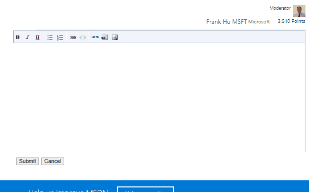

**clear - Does nothing**

**Divide - (the key / ) labels git issue as a doc-bug**
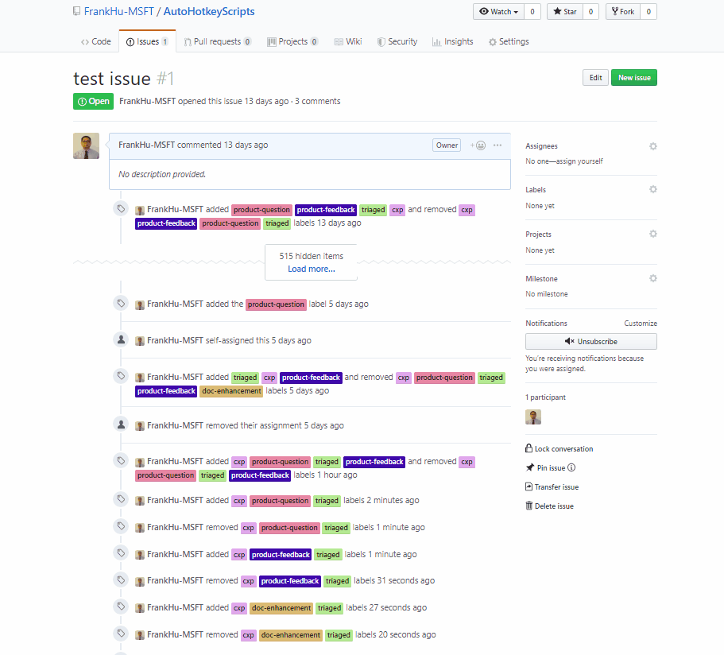

**+ - Alt Tabs**
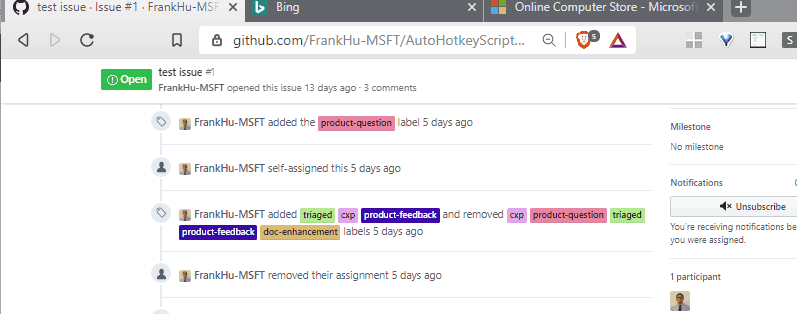

**Enter - Shift Alt Tabs**
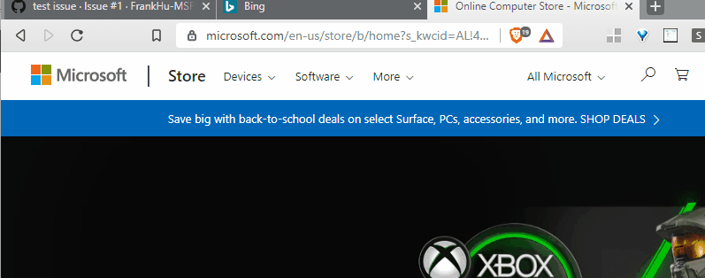

**Mult - URL Encodes text**

**Minus/-NumpadSub decodes url**

**NumLock  - Emergency Exit Button**

Please reach out to FRHU, if you're interested in a short video of me using it. 

# Support
If there are any issues in regards to this sample, please file a GitHub issue. This sample is not supported by Azure Support or Microsoft nor is this AHK associated with Microsoft.
